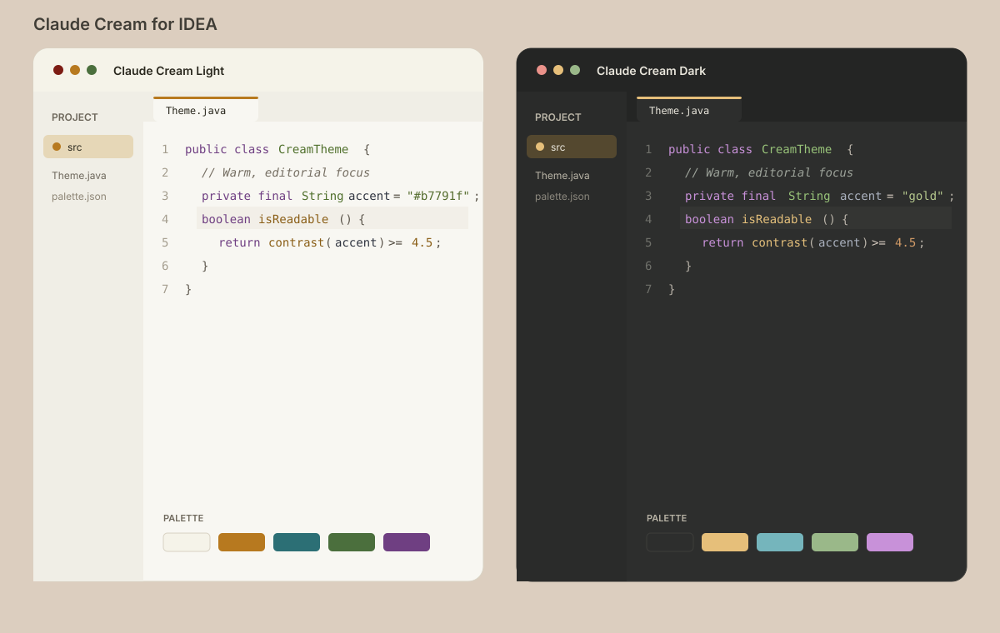

# Claude Cream for IDEA

一套面向 IntelliJ IDEA / IntelliJ Platform 的暖色编辑器主题，基于
[kakarrot-dev/claude-cream](https://github.com/kakarrot-dev/claude-cream) 的设计令牌制作。



## 主题

| 主题 | 视觉方向 | 编辑器背景 | 主强调色 |
|---|---|---:|---:|
| Claude Cream Light | 暖象牙、白色浮层、克制琥珀 | `#f8f7f2` | `#b7791f` |
| Claude Cream Dark | 暖炭灰、分层深色表面、柔和金色 | `#2d2e2d` | `#e6bf7a` |

两套主题同时覆盖 IDEA 界面、代码编辑器、控制台 ANSI 色、搜索、诊断、VCS
文件状态和 Diff。编辑器默认使用 IDEA 内置的 JetBrains Mono，字号为 14；安装后仍可在
Settings → Editor → Font 中调整。

## 安装

1. 下载 [`dist/claude-cream-idea-1.0.1.zip`](dist/claude-cream-idea-1.0.1.zip)。
2. 打开 Settings → Plugins。
3. 点击齿轮图标，选择 **Install Plugin from Disk...**。
4. 选择 ZIP 并按提示重启 IDEA。
5. 在 Settings → Appearance & Behavior → Appearance → Theme 中选择
   **Claude Cream Light** 或 **Claude Cream Dark**。

不要解压安装包，也不要从 Editor → Color Scheme 单独导入 XML；插件会让 UI 与编辑器方案保持同步。

## 来源分析

本项目分析基线为上游提交
[`a1e8d64`](https://github.com/kakarrot-dev/claude-cream/commit/a1e8d64cb4de3a8e0d5e31b695f37239b0f172b0)。
上游明确把 `tokens/tokens.json` 定义为 Codex、VS Code、Zed、Typora、Obsidian 和 Ghostty
共享的单一色彩源，因此本项目直接映射设计令牌，而非从截图近似取色。

主要映射如下：

| Claude Cream 语义 | IDEA 目标 |
|---|---|
| `colors.*.canvas` / `editor.*.canvas-default` | 主窗口与编辑器画布 |
| `surface-soft` / `canvas-inset` / `canvas-overlay` | 工具窗、标签栏、输入框和弹层层级 |
| `primary` / `focus` | 按钮、焦点边框、活动标签和光标 |
| `selection` / `accent-subtle` | 编辑器选区、列表选中、搜索匹配 |
| `syntax.*` | IDEA 默认语法属性、HTML/XML 与控制台 |
| `success` / `warning` / `error` | 诊断、VCS、断点与 Diff 状态 |

完整分析、对比度数据和取舍见 [`docs/ANALYSIS.md`](docs/ANALYSIS.md)，IDEA 使用的精简来源令牌见
[`palette/claude-cream.json`](palette/claude-cream.json)。

## 兼容性

- 插件声明 `since-build="243"`，即 IntelliJ Platform 2024.3 起。
- 不设置 `until-build`，可继续安装到 2025.x 和 2026.x。
- 主题仅使用稳定的 `themeProvider`、UI Theme JSON 和 color scheme XML，不包含平台私有代码。
- 已使用本机 IntelliJ IDEA Ultimate 2025.2.6.3 的实际解析器读取 Light/Dark UI 与编辑器资源。

目标兼容范围为 IDEA 2024.3–2026.x。由于当前环境未同时安装范围内的每个版本，发布前仍建议用
JetBrains Plugin Verifier 对计划发布的具体 IDE 构建做矩阵验证。

## 构建

无需下载 IntelliJ SDK，资源型插件可用 Python 标准库确定性打包：

```bash
python3 scripts/build.py
python3 scripts/validate.py
```

也可以使用本机 Gradle：

```bash
gradle buildPlugin
```

Python 构建产物位于 `dist/`，Gradle 构建产物位于 `build/distributions/`。

## 验证

静态验证会检查：

- plugin.xml、两个 Theme JSON、两个 editor scheme XML 的结构；
- 上游核心 token 是否漂移；
- UI 覆盖数量、命名色引用和 Light/Dark 配对；
- 编辑器语法、诊断、Diff、VCS 与控制台的必要属性；
- 正文与注释的 WCAG 4.5:1 对比度门槛；
- 安装 ZIP 和内部 JAR 的目录结构与资源完整性。

仓库还包含 [`scripts/IdeaThemeSmokeTest.java`](scripts/IdeaThemeSmokeTest.java)，可用已安装 IDEA 的
运行时类库执行真实解析器冒烟测试。

## 项目结构

```text
src/main/resources/
├── META-INF/plugin.xml
├── META-INF/pluginIcon.svg
├── META-INF/pluginIcon_dark.svg
└── themes/
    ├── ClaudeCreamLight.theme.json
    ├── ClaudeCreamLight.xml
    ├── ClaudeCreamDark.theme.json
    └── ClaudeCreamDark.xml
palette/claude-cream.json
scripts/build.py
scripts/validate.py
dist/claude-cream-idea-1.0.1.zip
```

## 许可与归因

上游 Claude Cream 采用 MIT License，原作者为段茱文（kakarrot0109）。本项目是非官方的
IntelliJ Platform 适配，保留原始许可与归因。详见 [`LICENSE`](LICENSE) 和
[`THIRD_PARTY_NOTICES.md`](THIRD_PARTY_NOTICES.md)。
